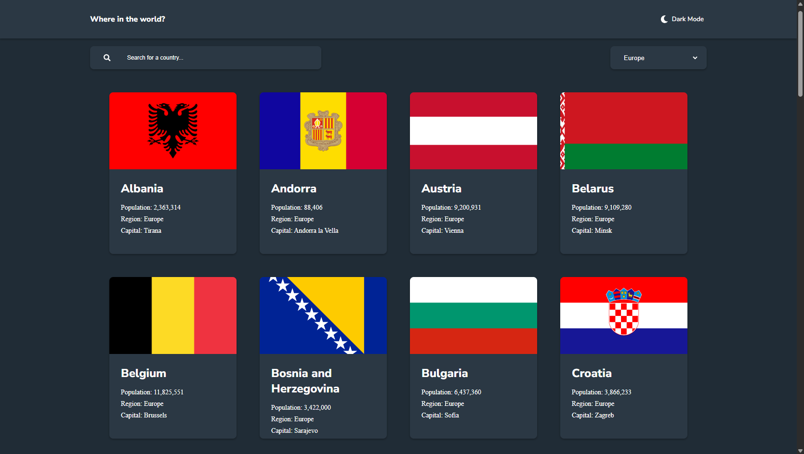
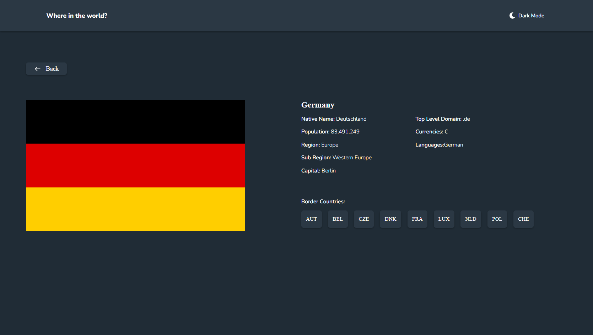

# REST Countries API

A responsive web application that allows users to explore information about countries around the world using the [REST Countries API](https://restcountries.com/). Built as a Frontend Mentor challenge solution.

## Overview

This project provides an intuitive interface to browse and search through information about all countries in the world. Users can filter countries by region, search by name, and view detailed information about each country including population, languages, currencies, and neighboring countries.

### Links

- **Live Site:** [https://rest-countries.denizaltun.de](https://rest-countries.denizaltun.de/)
- **Frontend Mentor Challenge:** [REST Countries API Challenge](https://www.frontendmentor.io/challenges/rest-countries-api-with-color-theme-switcher-5cacc469fec04111f7b848ca)

## Screenshots

### Home Page



### Details Page



## Features

### Core Functionality

- **Browse All Countries** - View all independent countries with essential information
- **Search** - Search for countries by name with real-time filtering
- **Filter by Region** - Filter countries by continent/region (Africa, Americas, Asia, Europe, Oceania)
- **Detailed Country View** - Click on any country to see comprehensive details including:
  - Native name
  - Population
  - Region and sub-region
  - Capital city
  - Top-level domain
  - Currencies
  - Languages
  - Border countries (clickable to navigate)

### User Experience

- **Dark/Light Mode Toggle** - Switch between dark and light themes with persistent preference
- **Responsive Design** - Fully responsive layout that works on mobile, tablet, and desktop
- **Loading States** - Smooth loading indicators while fetching data
- **Error Handling** - User-friendly error messages for failed requests
- **Intuitive Navigation** - Easy-to-use back button and clickable border countries
- **Optimized Performance** - Efficient data fetching and state management
- **Accessibility** - Focus states, semantic HTML, and keyboard navigation support

## Tech Stack

### Core Technologies

- **React 18** - Modern UI library with hooks
- **TypeScript** - Type-safe JavaScript for better developer experience
- **Vite** - Fast build tool and development server
- **React Router v7** - Client-side routing and navigation

### Styling

- **CSS3** - Custom CSS with modern features
- **CSS Custom Properties** - Theme system with CSS variables
- **CSS Grid & Flexbox** - Responsive layout system
- **Media Queries** - Responsive breakpoints

### API Integration

- **REST Countries API v3.1** - Source of country data
- **Fetch API** - Native browser API for HTTP requests

### Additional Libraries

- **React Icons** - Icon library (FontAwesome and custom icons)

## Project Structure

```
rest-countries-api/
├── src/
│   ├── components/           # Reusable React components
│   │   ├── Card.tsx         # Country card component
│   │   ├── Filter.tsx       # Region filter dropdown
│   │   ├── Header.tsx       # App header with title
│   │   ├── Loading.tsx      # Loading spinner component
│   │   ├── Search.tsx       # Search input component
│   │   └── ThemeToggle.tsx  # Dark/light mode toggle
│   ├── pages/               # Page components
│   │   ├── Detail.tsx       # Country detail page
│   │   ├── FetchFailed.tsx  # Error page for failed requests
│   │   ├── Home.tsx         # Home page with country list
│   │   └── NotFoundPage.tsx # 404 page
│   ├── service/             # API services
│   │   └── api.ts           # API fetch functions
│   ├── types/               # TypeScript type definitions
│   │   ├── app-types.ts     # Application types
│   │   └── countries.ts     # Country data types
│   ├── App.tsx              # Main app component
│   ├── main.tsx             # App entry point
│   └── index.css            # Global styles
├── public/                  # Static assets
└── package.json             # Dependencies and scripts
```

## Getting Started

### Prerequisites

- **Node.js** (v18 or higher)
- **npm** or **yarn**

### Installation

1. **Clone the repository**

   ```bash
   git clone https://github.com/ad-altun/rest-countries-api.git
   cd rest-countries-api
   ```

2. **Install dependencies**

   ```bash
   npm install
   # or
   yarn install
   ```

3. **Start the development server**

   ```bash
   npm run dev
   # or
   yarn dev
   ```

   The app will open at `http://localhost:5173`

### Building for Production

```bash
npm run build
# or
yarn build
```

The build artifacts will be stored in the `dist/` directory.

### Preview Production Build

```bash
npm run preview
# or
yarn preview
```

## Responsive Breakpoints

The application is fully responsive with the following breakpoints:

- **Mobile:** < 640px (40rem)
- **Tablet:** 640px - 896px (40rem - 56rem)
- **Medium:** 896px - 992px (56rem - 62rem)
- **Desktop:** 992px - 1200px (62rem - 75rem)
- **Large Desktop:** ≥ 1200px (75rem)

## Theme System

The application features a comprehensive dark/light theme system:

### Light Mode (Default)

- Background: Very Light Gray (#fafafa)
- Elements: White (#ffffff)
- Text: Very Dark Blue (#111517)

### Dark Mode

- Background: Very Dark Blue (#202c36)
- Elements: Dark Blue (#2b3844)
- Text: White (#ffffff)

Theme preferences are saved to `localStorage` for persistence across sessions.

## API Integration

### Endpoints Used

```typescript
// Get all independent countries
https://restcountries.com/v3.1/independent?status=true&fields=name,language,capital,region,flags,population

// Get country by name
https://restcountries.com/v3.1/name/{name}?status=true&fields=name,languages,capital,region,flags,population,currencies,subregion,borders,tld

// Get alpha-3 codes (for border countries)
https://restcountries.com/v3.1/independent?status=true&fields=name,cca3
```

### Data Types

The application uses TypeScript interfaces for type safety:

```typescript
interface HomePageProps {
  name: {
    common: string;
    official?: string;
    nativeName?: Record<string, { official?: string; common?: string }>;
  };
  population: number;
  region: string;
  capital: string[];
  flags: {
    png?: string;
    svg?: string;
    alt: string;
  };
}

interface DetailPageProps extends HomePageProps {
  currencies?: {
    [key: string]: { symbol?: string; name?: string };
  };
  languages?: Record<string, string>;
  borders?: string[];
  subregion?: string;
  topLevelDomain?: string[];
}
```

## Key Features Implementation

### Search Functionality

- **Real-time filtering** - Updates as you type
- **Case-insensitive** - Matches regardless of letter case
- **Partial matching** - Shows results containing the search term

### Filter by Region

- **Six options** - All, Africa, Americas, Asia, Europe, Oceania
- **Persistent selection** - Maintains filter state across searches
- **Combined filtering** - Works together with search functionality

### Country Details

- **Dynamic routing** - URL reflects selected country
- **Clickable borders** - Navigate to neighboring countries
- **Comprehensive data** - Shows all relevant country information
- **Alpha-3 code mapping** - Converts border codes to country names

### State Management

- **React Hooks** - useState, useEffect, useMemo for efficient state handling
- **Memoization** - useMemo for optimized filtering and sorting
- **Loading states** - Separate loading indicators for different views
- **Error handling** - Graceful error messages with retry options

## CSS Architecture

### Design System

**Color Variables:**

```css
/* Light Mode */
--primary-background: #fafafa;
--secondary-background: #ffffff;
--primary-text: #111517;
--placeholder-text: #c4c4c4;

/* Dark Mode */
--primary-background: #202c36;
--secondary-background: #2b3844;
--primary-text: #ffffff;
--placeholder-text: #ffffff;
```

**Shadow System:**

```css
--shadow-sm: 0 0.125rem 0.25rem rgba(0, 0, 0, 0.075);
--shadow-md: 0 0.25rem 0.5rem rgba(0, 0, 0, 0.1);
--shadow-lg: 0 0.5rem 1rem rgba(0, 0, 0, 0.15);
--shadow-xl: 0 1rem 2rem rgba(0, 0, 0, 0.2);
```

## Development

### Available Scripts

```bash
# Start development server
npm run dev

# Build for production
npm run build

# Preview production build
npm run preview

# Lint code
npm run lint

# Type check
npm run type-check
```

## Known Issues & Future Enhancements

### Known Issues

- None currently reported

## Contributing

Contributions are welcome! Please follow these steps:

1. Fork the repository
2. Create your feature branch (`git checkout -b feature/AmazingFeature`)
3. Commit your changes (`git commit -m 'Add some AmazingFeature'`)
4. Push to the branch (`git push origin feature/AmazingFeature`)
5. Open a Pull Request

## License

This project is open source and available under the [MIT License](LICENSE).

## Acknowledgments

- **Frontend Mentor** - For the challenge design and specifications
- **REST Countries API** - For providing comprehensive country data

## Contact

**Abidin Deniz Altun**

- GitHub: [@ad-altun](https://github.com/ad-altun)
- Project Link: [https://github.com/ad-altun/rest-countries-api](https://github.com/ad-altun/rest-countries-api)
- E-Mail: [contact@denizaltun.de](mailto:contact@denizaltun.de)

## Credits

This project was built as a solution to the [Frontend Mentor REST Countries API challenge](https://www.frontendmentor.io/challenges/rest-countries-api-with-color-theme-switcher-5cacc469fec04111f7b848ca).

---

**Built using React, TypeScript, and the REST Countries API**
